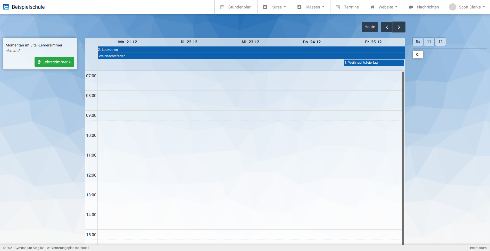

# Daten

Woher kommen die Daten im Dashboard und wie werden sie verarbeitet?

Zum Einstieg dienen die Dateien unterhalb von 
`/schul-dashboard/src/example-data/`, die im Folgenden beschrieben 
werden (inkl. eigener Eingaben).

Später kommen diese Daten natürlich per Schnittstelle aus den jeweiligen 
Quellsystemen wie WinSchule oder Untis. Wir werden nach und nach die 
Dokumentation um bereits angebundene Systeme erweitern.


## Schuljahr

Das Schuljahr wird in der Datei 
`src/example-data/config.yml` konfiguriert und enthält 
Beginn- und Ende-Datum des Schuljahres sowie den ersten Schultag.

```{.yml} 
---
:first_day: '2020-06-25'
:first_school_day: '2020-08-10'
:last_day: '2021-08-06'
```

## Ferien + Feiertage

Ferien, Feiertage und sonstige freie Tage (ohne Stundenplan!) werden 
durch den Aufruf von `./update-timetables.rb` aktualisiert (siehe 
[Installationsanweisung](Installation.md)). In unserer Testumgebung 
stehen die Daten dazu in 
`src/example-data/ferien_feiertage/ferien_feiertage.csv`.

Diese Datei hat drei Spalten und sieht wie folgt aus:

```{.csv}
Beginn,Ende,Titel
2019-06-20,2019-08-02,Sommerferien
2019-10-03,,Tag der Deutschen Einheit
2019-10-04,,Unterrichtsfrei
2019-10-07,2019-10-19,Herbstferien
2019-12-23,2020-01-04,Weihnachtsferien
2019-12-25,,1. Weihnachtsfeiertag
2019-12-26,,2. Weihnachtsfeiertag
2020-01-01,,Neujahr
2020-02-03,2020-02-08,Winterferien
2020-03-08,,Internationaler Frauentag
2020-04-06,2020-04-17,Osterferien
2020-04-10,,Karfreitag
2020-04-13,,Ostermontag
2020-05-01,,Tag der Arbeit
2020-05-08,,Tag der Befreiung
2020-05-21,,Christi Himmelfahrt
2020-05-22,,Pfingstferien
2020-06-01,,Pfingstmontag
2020-06-25,2020-08-07,Sommerferien
2020-10-03,,Tag der Deutschen Einheit
2020-10-12,2020-10-24,Herbstferien
2020-12-21,2021-01-02,Weihnachtsferien
2020-12-25,,1. Weihnachtsfeiertag
2020-12-26,,2. Weihnachtsfeiertag
2021-01-01,,Neujahr
2021-02-01,2021-02-06,Winterferien
2021-03-08,,Internationaler Frauentag
2021-03-29,2021-04-10,Osterferien
2021-04-02,,Karfreitag
2021-04-05,,Ostermontag
2021-05-01,,Tag der Arbeit
2021-05-13,,Christi Himmelfahrt
2021-05-14,,Pfingstferien
2021-05-24,,Pfingstmontag
2021-06-24,2021-08-06,Sommerferien
```

Hier können wir eigene Daten ergänzen. Neue Termine können wir einfach 
am Ende einfügen, es dient aber natürlich der besseren Übersicht diese 
gleich zeitlich richtig einzusortieren (z.B. `2020-12-16,2021-02-21,2. 
Lockdown` -- natürlich nur, wenn an diesen Tagen weder Aufgaben noch 
Homeschooling vorgesehen sind). Ein einzelner Tag wird einfach ohne 
Ende-Datum eingetragen (`2021-04-01,,Impfung Lehrkräfte`).

Die freien Tage werden im Kopfbereich des Kalenders angezeigt. An 
diesen Tagen gibt es keinen Stundenplan. Es können auch mehrere Termine 
an denselben Tagen gültig sein, wie man an folgendem Beispiel sehen 
kann: 




## Stundenplan

Der Stundenplan unserer Beispielumgebung liegt in 
`src/example-data/stundenplan/2020-08-10.TXT`. Änderungen am 
Stundenplan werden wie auch die Ferien und Feiertage mit 
`./update-timetables.rb` aktualisiert. Dabei ist zu beachten, dass 
**Änderungen immer ab dem Datum** des Dateinamens gelten.

Wenn wir also eine Raumänderung von Anfang an vornehmen wollen, können 
wir dies direkt in der Datei `2020-08-10.TXT` machen (erster Schultag 
SJ 2020/2021). Soll eine Änderung erst ab einem bestimmten Datum 
gelten, so legen wir zu diesem Datum eine neue Datei an. Wenn man 
keinen komplett neuen Stundenplan erstellen möchte, kann man den 
letzten gültigen kopieren und dann dort anpassen, also z.B. mit `cp 
2020-08-10.TXT 2021-03-29.TXT`. In der Regel wird man diesen aber aus 
dem System exportieren, mit dem der Stundenplan auch erstellt wurde, 
z.B. Untis.

Die Stundenplandatei hat folgenden Aufbau (und im Vergleich zu den 
Ferien keine Überschriftenzeile):

```{.txt}
2       "5a"    "Cl"    "Ma"    "109"   2       3
2       "5a"    "Cl"    "Ma"    "109"   2       4
2       "5a"    "Cl"    "Ma"    "110"   3       1
2       "5a"    "Cl"    "Ma"    "108"   4       1
2       "5a"    "Cl"    "Ma"    "108"   5       1
6       "5a"    "Cl"    "Nawi"  "317"   2       6
6       "5a"    "Cl"    "Nawi"  "317"   2       7
6       "5a"    "Cl"    "Nawi"  "323"   4       2
6       "5a"    "Cl"    "Nawi"  "323"   4       3
1083    "11"    "Cl"    "LA-L108"       "129"   1       2
1083    "11"    "Cl"    "LA-L108"       "129"   1       3
1083    "11"    "Cl"    "LA-L108"       "129"   3       2
1083    "11"    "Cl"    "LA-L108"       "129"   3       3
1083    "11"    "Cl"    "LA-L108"       "129"   5       8
1083    "12"    "Cl"    "LA-L108"       "129"   1       2
1083    "12"    "Cl"    "LA-L108"       "129"   1       3
1083    "12"    "Cl"    "LA-L108"       "129"   3       2
1083    "12"    "Cl"    "LA-L108"       "129"   3       3
1083    "12"    "Cl"    "LA-L108"       "129"   5       8
```

Hierbei sind die Spalten mit Tabs getrennt und Textfelder stehen in 
Anführungsstrichen. Die Spalten haben folgende Bedeutungen:

| Spalte | Bedeutung                                                                   |
| ------ | --------------------------------------------------------------------------- |
|      1 | Unterrichts-ID aus Untis                                                    | 
|      2 | die Klasse (siehe zum Mapping ggf. `src/ruby/credentials.rb`)               |
|      3 | Kürzel des Fachlehrers ( siehe `faecher/faecher.csv`)                       |
|      4 | Kürzel des Fachs (siehe `faecher/faecher.csv`)                              |
|      5 | Raumnummer                                                                  |
|      6 | Wochentag (Mo=1, Di=2,...)                                                  |
|      7 | Stunde (die Stundenzeiten sind auch in `src/ruby/credentials.rb` definiert) |

Wir sehen hier auch, dass Kurse problemlos zusammengelegt werden 
können, z.B. findet der Latein-Leistungskurs gemeinsam für die 11. und 12. Klassen statt.
